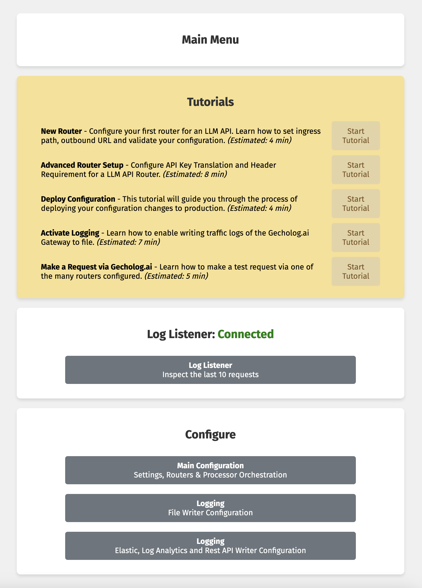
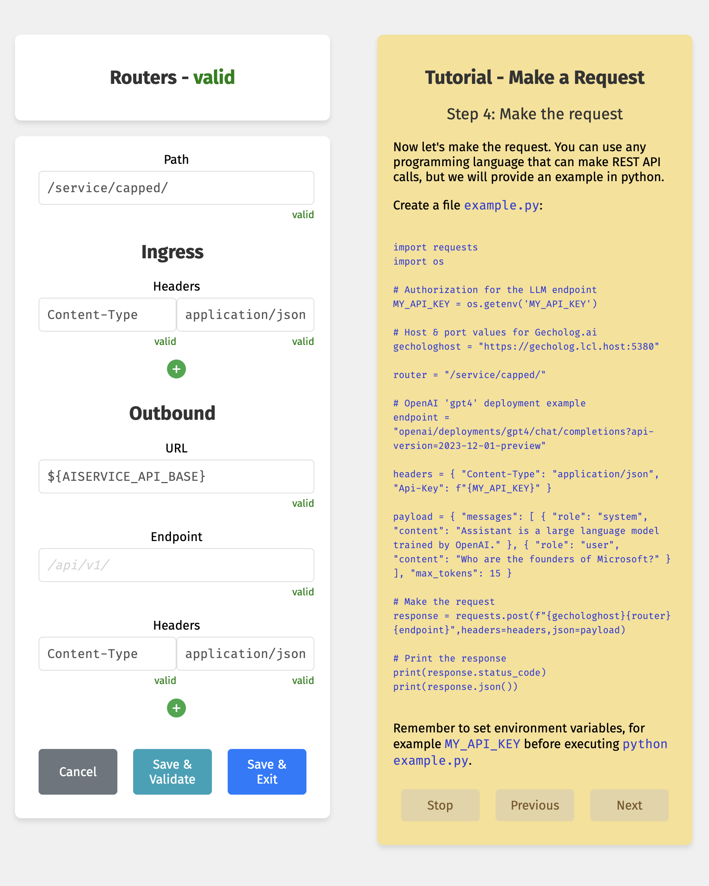

# Gecholog [ˈɡɛkoʊlɔɡ]

## Purpose

Gecholog is an open-source LLM Gateway and Endpoint Manager, originally developed and contributed by the team at [teneo.ai](https://www.teneo.ai). This project is available under the MIT License.

Gecholog is written in Go, and it is recommended to run it containerized. You can find the latest container build in the public container repository on [Docker Hub](https://hub.docker.com/r/direktoren/gecholog).

## Building

From the root of the source tree, run:

    VERSION=$(git describe --tags | cut -d'-' -f1 | sed 's/^v//')
    NATS_TOKEN=not_set
    GUI_SECRET=not_set
    docker build --secret id=NATS_TOKEN,env=NATS_TOKEN --secret id=GUI_SECRET,env=GUI_SECRET --no-cache --build-arg VERSION=$VERSION -f ./Dockerfile -t gecholog .

## Using

    docker run -d -p 8080:8080 -p 5380:5380 -e GUI_SECRET=set_a_password --name gecholog gecholog

Then click [http://localhost:8080/login](http://localhost:8080/login) and log in using the password you set. Start by running through the tutorials to learn the basic features of Gecholog.

## Environment variables

    docker run -d -p 8080:8080 -p 5380:5380 -e GUI_SECRET=set_a_password -e AISERVICE_API_BASE=https://your.openai.azure.com/ --name gecholog gecholog

To use environment variable references such as `${AISERVICE_API_BASE}` in the configuration files.

## Mount directories

    docker run -d -p 8080:8080 -p 5380:5380 -e GUI_SECRET=set_a_password -v ./conf:/app/conf -v ./log:/app/log -v ./certs:/config/certs --name gecholog gecholog

To mount one directory for config files, one for log writing and one for cert files.

## Service Components

The Gecholog container contains the following services (see `cmd/` folder)

 - `entrypoint` prepares configuration files and starts the `ginit` service. [Read more...](cmd/entrypoint/)
 - `ginit` is the process supervisor and monitors configuration file changes. [Read more...](cmd/ginit/)
 - `gl` is the actual API call routing service. [Read more...](cmd/gl/)
 - `gui` runs the configuration UI. [Read more...](cmd/gui/)
 - `healthcheck` is a simple service to confirm if a service is running. [Read more...](cmd/healthcheck/)
 - `nats2log` listens to the `nats-server` bus for log entries and writes them to a file, rest api, elastic or azure log analytics. [Read more...](cmd/nats2log/)
 - `nats-server` is the internal lightweight service bus. Kudos to the team at [nats.io](https://github.com/nats-io/nats-server).
 - `tokencounter` is a processor to standardize the token consumption fields in the logs. [Read more...](cmd/tokencounter/)

## Connect Micro-Services to Gecholog

If you want to manipulate (process) the payload, headers or response body you can connect your own processors to Gecholog for real-time or post-processing. Visit [gecholog-resources](https://github.com/direktoren/gecholog-resources/) for examples on how to mock an LLM API, load balancing or run natural language processing via Gecholog.

## License

This project is licensed under the MIT License.
See the [LICENSE](https://github.com/direktoren/gecholog/blob/main/LICENSE) file
for the full license text.

## Open Source Declaration

The Gecholog container build includes and utilizes NATS server, an open-source messaging system. Find license at `/usr/share/doc/nats-server/LICENSE`. We use NATS server under the terms of the Apache License 2.0. Our team acknowledges and appreciates the contributions of the developers and community behind NATS server to the open-source ecosystem. For details on the license, please find the Apache License 2.0 [here](https://www.apache.org/licenses/LICENSE-2.0).

## Screenshots

Looking for an overview of the interface? Check it out!

