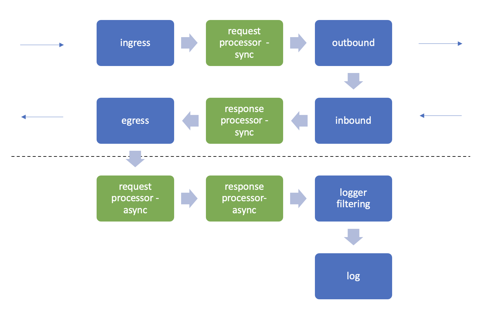

# Service `gl`

## Short summary

The `gl` service is the LLM API routing service of the Gecholog container. It accepts (1) inbound traffic on specific paths (routers) and forwards (2) the outbound request to the target. Then it accepts the (3) inbound response, and feeds back the (4) egress response to the requestor. `gl` performs input verification of the requests, allows micro-services (processors) to alter the request and response and finally writes the call log to the service bus.

## Options

| Option             | Description                                               |
|--------------------|-----------------------------------------------------------|
| -a                 | alias, set the name of the service                        |
| -o                 | specify filepath to configuration file                    |
| --validate         | print config validation info (accepts stdin)              |
| --version          | print version                                             |

## Example

This is how to validate a new config file in the docker context

    docker exec -e NATS_TOKEN=set gecholog ./gl -o app/conf/new_gl_config.json --validate

## Configuration file

Example of the configuration file for the `gl` service can be found [here](../../config/gl_config.json).

| Field              | Description                                               |
|--------------------|-----------------------------------------------------------|
| gateway_id         | gateway name & prefix of the Session ID                   |
| gl_port            | port number for the service. Default 5380*                |
| logger             | configuration for logging filters                         |
| log_level          | one of `DEBUG` `INFO` `WARN` `ERROR`                      | 
| log_unauthorized   | activate log writing for unauthorized requests            | 
| masked_headers     | list of headers to obfuscate in  logs and to processors   |
| remove_headers     | list of headers to remove at outbound and egress          |
| response           | scheduling of `response` processors                       |
| request            | scheduling of `request` processors                        |
| routers            | definitions of ingress and outbound routing rules         |
| service_bus        | internal service bus configuration and                    |
| session_id_header  | header name for Session ID                                |
| tls                | TLS settings                                              |
| version            | the config file conforms to this specification            | 

* Why that default port? GECHO -> GE8O -> 5380.

## Flow order

Flow order and terminology:

## Session ID and Transaction ID

The Session value is constructed as follows

    GATEWAYID_TIMEBASEDVALUE_SESSIONCOUNT_TRANSACTIONCOUNT

Example of a Session response header from an API call via Gecholog

    Session-Id: TST00001_1699884006500487748_1_0

A second API call via Gecholog generates a new Session value

    Session-Id: TST00001_1699884006508924567_2_0

By using an existing Session value as a request header you can instead increase the transaction count. If you use the Session request header `Session-Id: TST00001_1699884006500487748_1_0` Gecholog will generate a new transaction instead of a new session

    Session-Id: TST00001_1699884006500487748_1_1
